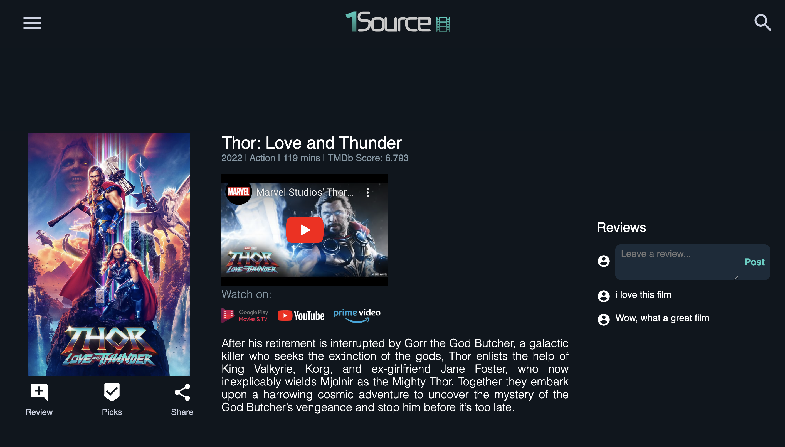
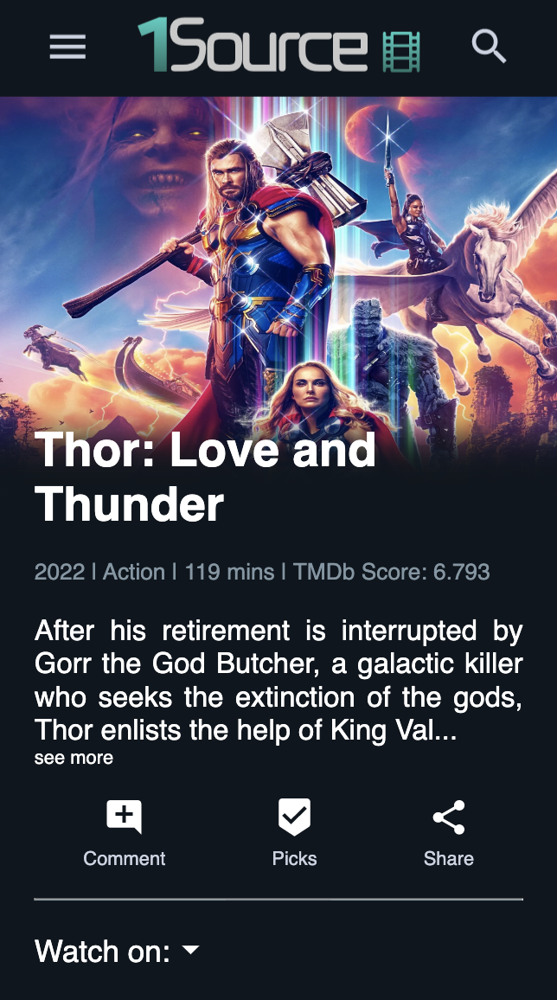
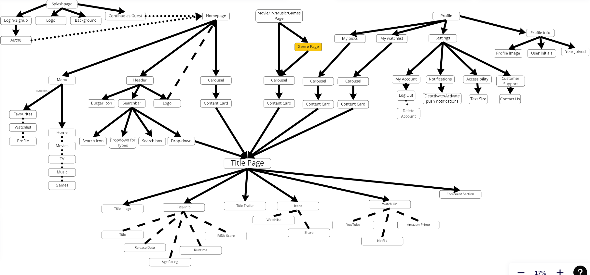

# WELCOME TO THE 1SOURCE DOCUMENTATION

1Source is a multimedia discovery app that can be used to discover new TV, Movies, Music & Games all on the same website. 

This is the desktop view of the homepage:


This is a title page displayed for desktop:




This is a title page displayed for mobile:



 

## COMPONENT TREE

Here’s a breakdown of our component tree




## HOW TO RUN THE APP LOCALLY

STEP 1 : Clone the project
```
npm clone https://github.com/SchoolOfCode/final-project_front-end-odd-socs.git
```

STEP 2: Install dependencies
```
npm i
```
STEP 3: Run the app
```
npm run dev
```
Open http://localhost:3000 with your browser to see the result.

Alternatively, here’s a link to the deployed site:
https://1source.netlify.app/ 


## TECH STACK

Design: Figma, Miro, Photoshop, Illustrator, After Effects
Build: Next JS, Styled Components, MUI library, Firebase, Node JS, Netlify
Project Management: Slack, Zoom, Miro, Trello, Google Docs


## LESSONS LEARNED (REFLECTIONS)

We came across a number of challenges throughout the four week project. Some of the key areas were identifying a real-world user problem and a solution to answer, learning new and unfamiliar technologies and effective project management. 

### Identifying a real-word user problem & finding a solution

We wanted to develop a user-centered product. So, using the UX design process, we investigated various user problems, carried out user research, ideated potential solutions, created prototypes, and gathered user feedback to test the viability of our chosen solution.

### Learning new tech

#### Firebase
Authentication was a crucial feature of our MVP. We wanted to use an application that easily links authentication to our backend database and so we decided to integrate Firebase into our application. Firebase authentication and databasing was something entirely new to all of us. Learning and implementing Firebase proved to be an exciting challenge to overcome in such a short space of time. 

#### Styled Components & Next JS
Integrating styled components into our app was also something that was new and unfamiliar to us. However, we soon adapted and it made creating the layout and design of the website simpler and more time efficient. 


### Project management

Time management and efficiency was going to be one of our main barriers to achieving our MVP in the four week timeframe. To overcome this, we worked together taking an agile approach, breaking up the project into manageable sprints. Also, we selected a different scrum master each day, to give everybody the opportunity to facilitate the tasks for the day. Furthermore, we organised our workload on trello by creating tickets for all of our tasks.


## FUTURE IMPLEMENTATION

In future sprints we would like to implement the following features/improvements:
- Adding authentication to the reviews section - so that the user’s profile image and username are displayed alongside their review
- Adding a play/pause button to the splash graphics - this would be in response to user feedback to help further improve accessibility
- Adding more media types -  e.g. podcasts 
- Optimising site performance - The image loading time, overall site responsiveness to screen varying screen sizes.


## AUTHORS

@DevMattDavies
@leoarthurwall
@stardust5555
@Amaan-Memon
@Esva
@Ryanb121
